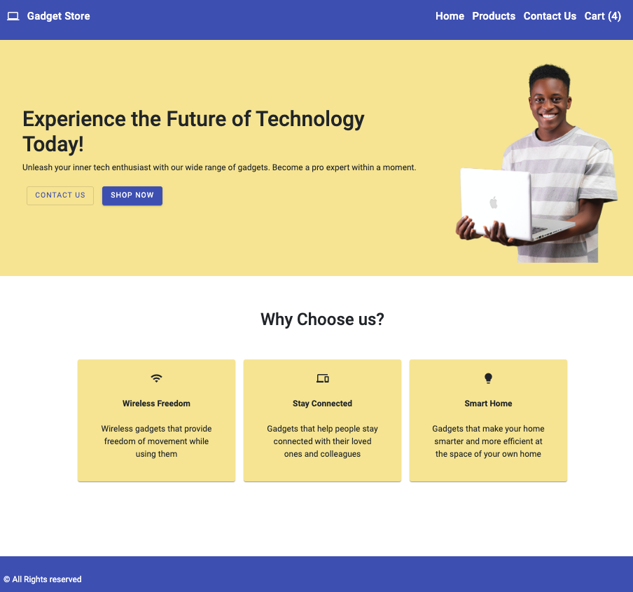
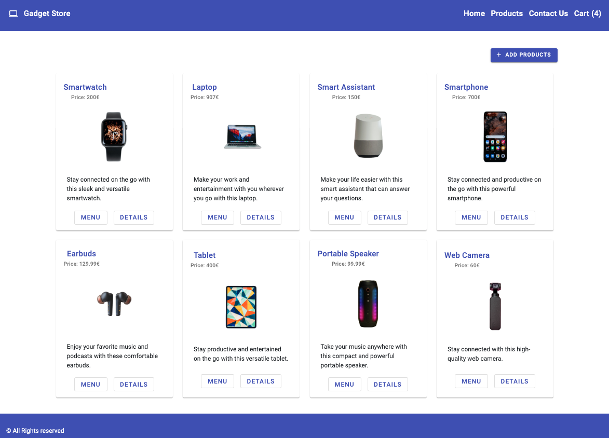

# GadgetStore

This project was generated with [Angular CLI](https://github.com/angular/angular-cli) version 17.3.2.

## How o start application

### Development server

Run `ng serve` for a dev server. Navigate to `http://localhost:4200/`. The application will automatically reload if you change any of the source files.

### run json-server separately
Run `npm run json-run` to start mock database separately.

### run json-server and app together
Run `npm run start` to start mock database and app together. It Will open app page automaticaly on `http://localhost:4200/` and json-server will start on `http://localhost:8000/`.

## Running unit tests

Run `ng test` to execute the unit tests via [Karma](https://karma-runner.github.io).

## Make Google map work

Generate your Google map API key and provide it in index.html file under script tag. How to get API key: https://developers.google.com/maps/documentation/javascript/get-api-key
Generate yoru map ID and provide it in map.component.htm file. How to get Map ID: https://developers.google.com/maps/documentation/get-map-id

## Further help

To get more help on the Angular CLI use `ng help` or go check out the [Angular CLI Overview and Command Reference](https://angular.io/cli) page.

## Some Screenshots from app

